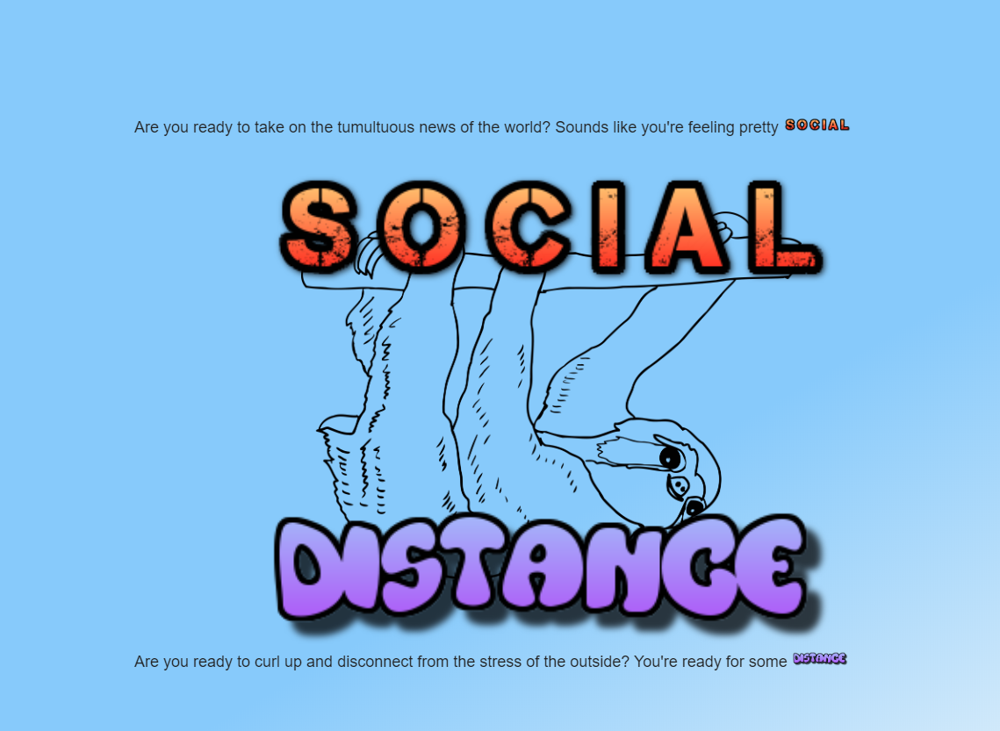

<a href="https://the-medium-place.github.io/covidDistractions/"><h1>Social // Distance</h1></a>

Are you tired of seeing the same depressing new headline every time you open your phone? Are you ready for a short distraction to take you away for a moment?

**Social // Distance** allows the user to navigate away from the _news_ and into the comforting embrace of distraction.

<!-- View it [Here](https://bbelka.github.io/covidDistractions/)! -->

## Build Tools

* [Skeleton Framework](https://skeleton-framework.github.io/)

* [Animate: CSS](https://daneden.github.io/animate.css/)

## API Resources

* [OMDb API](http://www.omdbapi.com/)

* [utelly API](https://rapidapi.com/utelly/api/utelly)

* [News API](https://newsapi.org/)

* [Rawg API](https://rawg.io/apidocs)

## Contributors

* [@bbelka](http://github.com/bbelka) - Project Manager

* [@heigertd](http://github.com/heigertd) - Front-end/Back-end Dev

* [@michaelzunigaa](http://github.com/michaelzunigaa) - Front-end/Back-end Dev

* [@the-medium-place](http://github.com/the-medium-place) - Front-end/Back-end Dev